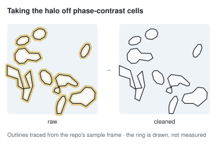
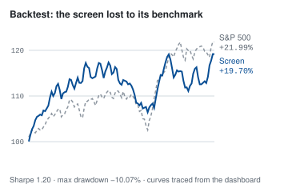
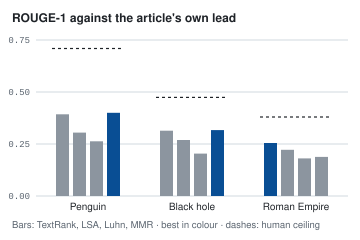
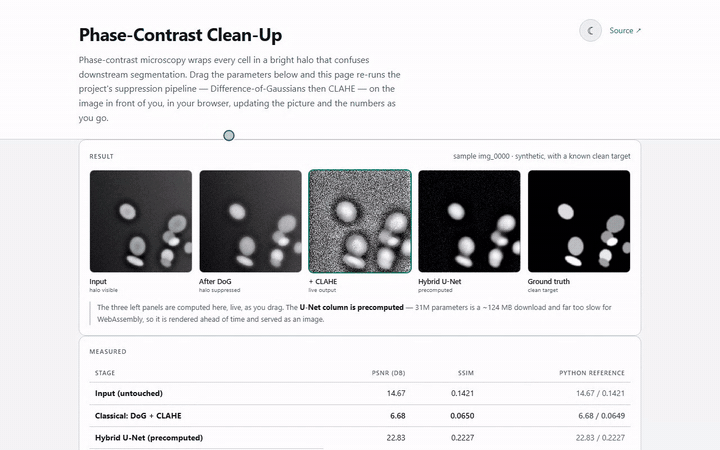
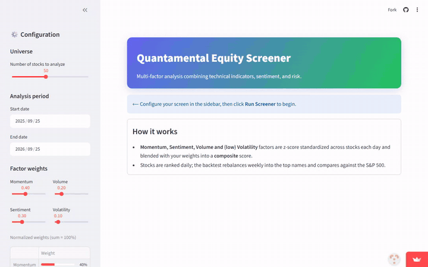
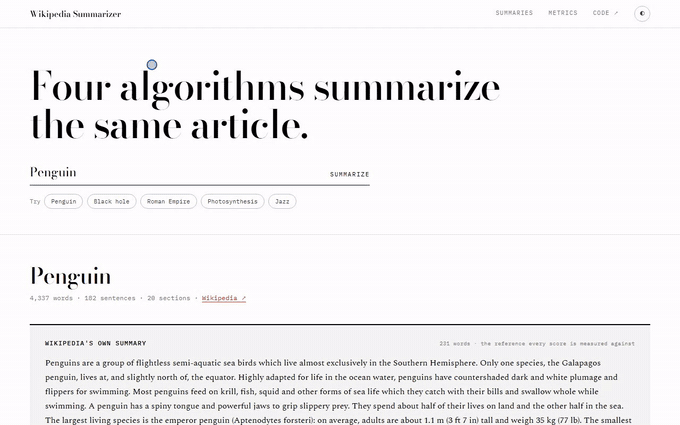
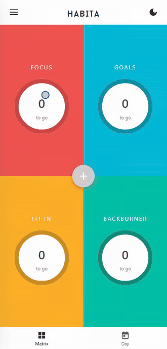
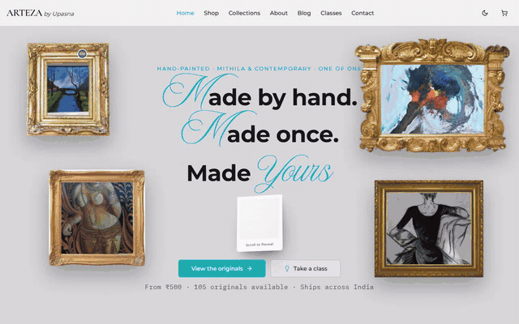
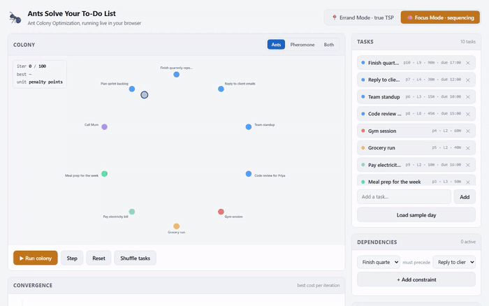
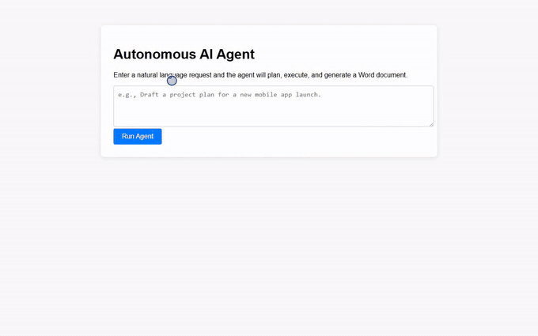

## Akshayaa Kashyap

<samp>AI engineer · India</samp> 
<samp><a href="https://akshayaa-403.github.io/portfolio/">portfolio</a> · <a href="https://linkedin.com/in/akshayaa-kashyap">linkedin</a> · <a href="https://akshayaakashyap.substack.com">substack</a> · <a href="https://akshayaa-403.github.io/portfolio/public/assets/resume.pdf">résumé</a> · akshayaakashyap5@gmail.com</samp>

 

I build the part between a messy source and a decision someone has to make. Three of those, each drawn from its own data:

<table>
<tr>
<td width="33%" valign="top">
<a href="https://github.com/akshayaa-403/phase-contrast-denoising"><picture><source media="(prefers-color-scheme: dark)" srcset="assets/figures/halo-dark.svg"></picture></a>
 <b>Phase-contrast clean-up</b> 
DoG and CLAHE, then an optional residual U-Net. PSNR 12.87 → 20.62 dB over six synthetic samples. 
<a href="https://github.com/akshayaa-403/phase-contrast-denoising">code</a> · <a href="https://akshayaa-403.github.io/portfolio/work/phase-contrast-denoising.html">case study</a>
</td>
<td width="33%" valign="top">
<a href="https://github.com/akshayaa-403/quantamental-screener"><picture><source media="(prefers-color-scheme: dark)" srcset="assets/figures/backtest-dark.svg"></picture></a>
 <b>Quantamental Screener</b> 
Momentum, sentiment, volume and volatility, z-scored and blended. It lost to the index, at Sharpe 1.20. 
<a href="https://quantamental-screener.streamlit.app">app</a> · <a href="https://github.com/akshayaa-403/quantamental-screener">code</a> · <a href="https://akshayaa-403.github.io/portfolio/work/quantamental-screener.html">case study</a>
</td>
<td width="33%" valign="top">
<a href="https://github.com/akshayaa-403/Wikipedia-Summarizer"><picture><source media="(prefers-color-scheme: dark)" srcset="assets/figures/rouge-dark.svg"></picture></a>
 <b>Wikipedia Summarizer</b> 
Four summarisers against the humans who wrote the lead. The winner changes with the article. 
<a href="https://akshayaa-403.github.io/Wikipedia-Summarizer/">demo</a> · <a href="https://github.com/akshayaa-403/Wikipedia-Summarizer">code</a> · <a href="https://akshayaa-403.github.io/portfolio/work/wikipedia-summarizer.html">case study</a>
</td>
</tr>
</table>

### Research

<table>
<tr>
<td width="55%" valign="top"></td>
<td valign="top">
<b><a href="https://github.com/akshayaa-403/phase-contrast-denoising">Phase-contrast clean-up</a></b> · 2026 
Python · OpenCV · PyTorch · Gradio  
Takes the bright halo off phase-contrast microscopy. A difference-of-Gaussians pass and CLAHE, then an optional 31M-parameter residual U-Net that predicts the leftover artifact and subtracts it. The browser port of the classical half agrees with OpenCV to about 50 dB PSNR.  
Recorded running the repo's <code>docs/</code> demo locally. 
<a href="https://github.com/akshayaa-403/phase-contrast-denoising">code</a> · <a href="https://akshayaa-403.github.io/portfolio/work/phase-contrast-denoising.html">case study</a>
</td>
</tr>
<tr>
<td valign="top"></td>
<td valign="top">
<b><a href="https://github.com/akshayaa-403/quantamental-screener">Quantamental Screener</a></b> · 2025–26 
Python · pandas · Streamlit · Redis · Docker  
Ranks S&amp;P 500 stocks on momentum, news sentiment, volume and volatility. Each factor is z-scored across the day's universe, clipped at ±3 and weighted 0.4 / 0.3 / 0.2 / 0.1. Sentiment is VADER and TextBlob, with FinBERT optional. It has a rebalancing backtest.  
Recorded on the hosted app with its mock-sentiment switch on. 
<a href="https://quantamental-screener.streamlit.app">app</a> · <a href="https://github.com/akshayaa-403/quantamental-screener">code</a> · <a href="https://akshayaa-403.github.io/portfolio/work/quantamental-screener.html">case study</a>
</td>
</tr>
<tr>
<td valign="top"></td>
<td valign="top">
<b><a href="https://github.com/akshayaa-403/Wikipedia-Summarizer">Wikipedia Summarizer</a></b> · 2025–26 
JavaScript · Playwright  
Runs TextRank, LSA, Luhn and MMR over any Wikipedia article in the browser. It scores each summary with ROUGE against the article's own lead, trimmed to the same word budget. The best reaches 56–67% of that human ceiling, and everything recomputes in about 60 ms. 33 Playwright checks drive the real page.  
<a href="https://akshayaa-403.github.io/Wikipedia-Summarizer/">demo</a> · <a href="https://github.com/akshayaa-403/Wikipedia-Summarizer">code</a> · <a href="https://akshayaa-403.github.io/portfolio/work/wikipedia-summarizer.html">case study</a>
</td>
</tr>
</table>

### Products

<table>
<tr>
<td width="55%" valign="top" align="center"></td>
<td valign="top">
<b><a href="https://github.com/akshayaa-403/Habita">Habita</a></b> · 2026 
JavaScript · Capacitor · Java  
An Android task manager built on the Eisenhower matrix. You sort tasks by urgency and importance, then drag them onto a day timeline. A small native plugin over Android's CalendarContract writes each block into the phone's own calendar. There's no published build yet.  
Recorded as the browser build, where calendar sync is off. 
<a href="https://github.com/akshayaa-403/Habita">code</a> · <a href="https://akshayaa-403.github.io/portfolio/work/habita.html">case study</a>
</td>
</tr>
<tr>
<td valign="top"></td>
<td valign="top">
<b><a href="https://arteza.site">Arteza</a></b> · client 
React · Supabase  
A storefront for an original-art studio, with the work in five curated collections, a style quiz, class booking, and a checkout that hands off to WhatsApp, where the studio already sells. It's client work, so there's no public repo.  
<a href="https://arteza.site">live</a> · <a href="https://akshayaa-403.github.io/portfolio/work/arteza.html">case study</a>
</td>
</tr>
</table>

### Experiments

<table>
<tr>
<td width="55%" valign="top"></td>
<td valign="top">
<b><a href="https://github.com/akshayaa-403/anttodo">anttodo</a></b> · 2026 
JavaScript · Canvas  
Ant colony optimisation on a day's tasks, drawn live. There are two modes: a real TSP over errands with haversine distances, and a cost function over a workday. It uses Max-Min Ant System bounds, dependency-aware construction and 2-opt. 104 test assertions run against the shipped page.  
<a href="https://akshayaa-403.github.io/anttodo/">demo</a> · <a href="https://github.com/akshayaa-403/anttodo">code</a> · <a href="https://akshayaa-403.github.io/portfolio/work/anttodo.html">case study</a>
</td>
</tr>
<tr>
<td valign="top"></td>
<td valign="top">
<b><a href="https://github.com/akshayaa-403/agent_project">agent_project</a></b> · 2026 
Python · FastAPI · Ollama  
A small agent that plans a request, executes each step, reflects on the result and writes a .docx. It runs a local Llama 3.2 through Ollama. The research step is a stub, so the output shows the loop rather than real research.  
Recorded running locally. 
<a href="https://github.com/akshayaa-403/agent_project">code</a>
</td>
</tr>
<tr>
<td valign="top" align="center">No recording yet. The demo page is built, but the trained weights aren't published, so it has no model to run.</td>
<td valign="top">
<b><a href="https://github.com/akshayaa-403/yosemite-image-translation-gan">yosemite-image-translation-gan</a></b> · 2025–26 
Python · PyTorch · ONNX  
A CycleGAN that turns summer photographs of Yosemite into winter ones and back, trained on unpaired images. I rebuilt it from a Colab notebook with 64 tests, fixing the notebook's real bugs along the way.  
<a href="https://github.com/akshayaa-403/yosemite-image-translation-gan">code</a>
</td>
</tr>
</table>
